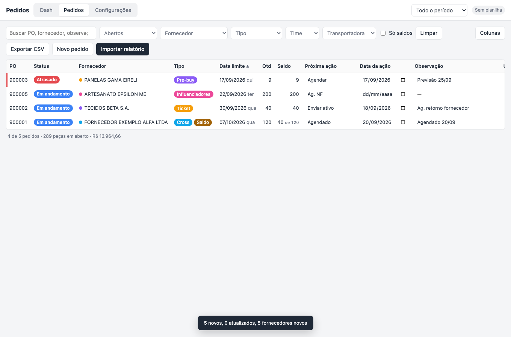

# system-julia-oliveira

Sistema interno para acompanhar pedidos de compra (PO): importa o relatório do sistema, organiza por prazo,
guarda observações e ações, e envia aviso diário por e-mail.

**App:** https://flux-marketing-ai.github.io/system-julia-oliveira/



## Como funciona

- **Front:** `index.html` + `app.js` + `style.css` + `core.js` (HTML/CSS/JS puro, sem framework, sem build). GitHub Pages deste repositório. Atualizar = commit na `main`.
- **Dados:** Google Sheets privado do usuário, acessado por Apps Script publicado como app da web ([`apps-script/Code.gs`](apps-script/Code.gs) + o mesmo `core.js`). O navegador guarda cache e fila de envio; a planilha é a fonte da verdade.
- **Avisos:** gatilho diário do Apps Script, envia pelo Gmail da conta. Horário, dias e antecedência configurados no app.
- **Segurança:** chave de acesso validada pelo script; nada no repositório dá acesso a dado nenhum.

## Documentos

- [docs/01-especificacao-v1.md](docs/01-especificacao-v1.md) — o que o sistema faz e por quê (validado em 18/09/2026).
- [docs/02-instalacao.md](docs/02-instalacao.md) — passo a passo pra criar a planilha e ligar o app (15 min, uma vez).

## Desenvolver

```
node tests/core.test.js         # regras puras (datas úteis, CSV, importação, status, e-mail)
node tests/apps-script.test.js  # Code.gs com planilha simulada em memória
node tests/smoke.js             # tela real em Chrome headless (precisa do Google Chrome instalado)
node tests/screenshot.js        # regenera docs/img
```

Regra do repositório: **nenhum dado real, chave ou link de planilha entra aqui.** `amostras/` só com dado fictício.
